# kebun — NixOS config for sakura

Kebun is a NixOS system flake for `sakura` (ThinkPad X13 Gen 1, AMD Renoir
APU) — a single-host, single-user configuration, desktop = kebun's port of
[Omarchy](https://omarchy.org) v4 ("Quattro") to NixOS idioms (QuickShell
shell, Hyprland Lua, palette-driven theming).

Since [ADR-0013](docs/adr/0013-adopt-den-aspect-oriented-framework.md) the
wiring is **aspect-oriented via [Den](https://github.com/denful/den)**:
one aspect per concern, entities declared as data, context delivered as
function args.

## At a glance



Two scopes: `host:sakura` (NixOS) and `user:ivokun` (home-manager, nested).
The host's aspect spine (`networking` → `core` → `dev` → `shell-entry` →
`printing` → `hostname` → `snapper`) mounts via aspect `includes`; glue
between the scopes is done by the `host-to-users` policy, the
`hm-user-detect` battery, and the `os-to-host` forward. Purple nodes are
`/os` (nixos-class) content, orange `/user` nodes are homeManager-class
content.

See all views: **[diagrams/hosts/sakura.md](diagrams/hosts/sakura.md)** ·
**[diagrams/fleet.md](diagrams/fleet.md)** (fleet DAG, namespace,
aspect-matrix, pipe-flow, policy-map, scope-topology).
Regenerate: `nix run .#write-diagrams` (den-diagram, rose-pine-dawn theme).

## Commands

```bash
nixos-rebuild build --flake .#sakura   # eval + build without activating
nh os switch .                         # apply (normal path)
nix fmt                                # alejandra formatter
nix run .#write-diagrams               # regenerate diagrams/
```

Post-switch verification: `systemctl --failed`,
`systemctl --user --failed`, `journalctl -b -p warning`.

## Layout

| Path | Purpose |
|---|---|
| `modules/den.nix` | Entity declarations (`den.hosts.x86_64-linux.sakura.users.ivokun`), defaults |
| `modules/aspects/*.nix` | NixOS aspects: core, desktop, dev, networking, printing, snapper |
| `modules/users.nix` | The ivokun user aspect (wires `home/**` into `den.aspects.ivokun`) |
| `modules/diagrams.nix` | den-diagram rendering wiring |
| `hosts/sakura/` | Host-specific: hardware, LUKS/TPM2, power, NFS, Docker |
| `home/**` | Home-Manager modules (imported untouched into the user aspect) |
| `packages/` | Script derivations, vendored Omarchy env/theme, wordmark, Plymouth |
| `docs/adr/` | Architecture decision records |

## Docs

- [ADR-0013 — Den adoption](docs/adr/0013-adopt-den-aspect-oriented-framework.md)
  (includes the A/B build-equivalence verification)
- [INSTALL.md](INSTALL.md) — full install guide (LUKS + BTRFS + flakes)
- [CLAUDE.md](CLAUDE.md) — agent-facing conventions and gotchas (AGENTS.md symlinks to it)
- `docs/omarchy/` — upstream Omarchy research briefs
- `docs/omarchy-parity-backlog.md` — outstanding follow-ups
