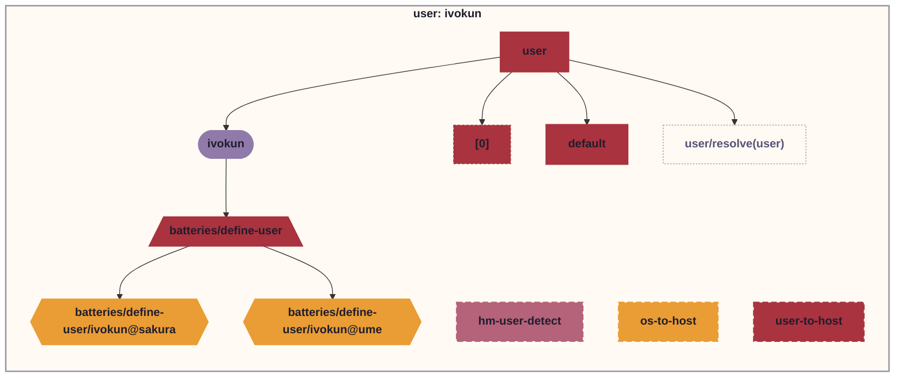

# kebun — NixOS config for sakura & ume

Kebun is a NixOS system flake for two machines, one user (ivokun):

- **sakura** — ThinkPad X13 Gen 1 (AMD Renoir), laptop, live since
  2026-09-04 — the deployed, managed machine.
- **ume** — ASRock B550M-ITX/ac desktop (Ryzen 9 5900X, RX 9060 XT),
  currently the ivokun-htpc hardware, **pre-install** until its disk is
  migrated ([INSTALL-UME.md](INSTALL-UME.md)).

Desktop = kebun's port of [Omarchy](https://omarchy.org) v4 ("Quattro") to
NixOS idioms (QuickShell shell, Hyprland Lua, palette-driven theming),
single-sourced across hosts and re-skinned per-machine facts. Since
[ADR-0013](docs/adr/0013-adopt-den-aspect-oriented-framework.md) the
wiring is **aspect-oriented via [Den](https://github.com/denful/den)**:
one aspect per concern, entities declared as data, context delivered as
function args; [ADR-0017](docs/adr/0017-model-multiple-hosts-with-host-owned-hardware.md)
extends it to multiple hosts (shared `host-base` aspect + typed
`kebun.host` capability options reaching Home Manager via `osConfig`).

## At a glance

| Host | Machine | Class | Hardware files | Status |
|---|---|---|---|---|
| sakura | ThinkPad X13 Gen 1 (Renoir) | laptop | `hosts/sakura/` | live since 2026-09-04 |
| ume | ASRock B550M-ITX/ac (5900X / RX 9060 XT) | desktop | `hosts/ume/` | pre-install (see [INSTALL-UME.md](INSTALL-UME.md)) |

Two scopes: `host:sakura` and `host:ume` (NixOS) with a nested shared
`user:ivokun` (home-manager) each. The host aspects (`core`, `desktop`,
`dev`, `networking`, `printing`, `snapper`, `shell-entry`, `host-base`,
and `hostname`) mount via `includes`; the glue between the scopes is the
`host-to-users` policy, the `hm-user-detect` battery, and the
`os-to-host` forward. Graphs are the auto-generated mermaid sections at
the bottom of this page — rendered natively by GitHub (no build
artifacts). Regenerate with `nix run .#update-readme`.

## Commands

```bash
nix build .#nixosConfigurations.sakura.config.system.build.toplevel  # any Nix host
nix build .#nixosConfigurations.ume.config.system.build.toplevel     #   " (pre-install)

nixos-rebuild build --flake .#sakura   # on sakura
nixos-rebuild build --flake .#ume      # on ume (post-install only)

nh os switch .                         # apply — ON the target host only
```

Build/apply from *any* machine with Nix; **activate only on the matching
target** (sakura switches on sakura, ume switches on ume — never
build-then-switch cross-host). Post-build verification after a switch:
`systemctl --failed`, `systemctl --user --failed`,
`journalctl -b -p warning`.

```bash
nix fmt                                # alejandra formatter
nix run .#update-readme               # regenerate the mermaid graphs section
```

## Layout

| Path | Purpose |
|---|---|
| `modules/den.nix` | Den flake-module entrypoint and formatter |
| `modules/aspects/*.nix` | NixOS aspects: core, desktop, dev, networking, printing, snapper — shared workstation policy |
| `modules/aspects.nix` | Aspect/entity wiring, defaults, `host-base` (incl. `kebun.host` capability options), host aspects |
| `modules/users.nix` | The ivokun user aspect (wires `home/**` into `den.aspects.ivokun`) |
| `modules/diagrams-mermaid.nix` | mermaid graph generation into README (den-diagram) |
| `hosts/sakura/` | Sakura hardware facts: LUKS/TPM2, power profiles, ThinkPad modules |
| `hosts/ume/` | ume hardware facts: GPU/Steam, B550 firmware, current disk snapshot |
| `home/**` | Home-Manager modules (imported untouched into the user aspect; host variance via `osConfig`) |
| `packages/` | Script derivations, vendored Omarchy env/theme, wordmark, Plymouth |
| `docs/adr/` | Architecture decision records |

## Docs

- [ADR-0013 — Den adoption](docs/adr/0013-adopt-den-aspect-oriented-framework.md)
  (includes the A/B build-equivalence verification)
- [ADR-0014 — Workstation trust boundaries](docs/adr/0014-harden-workstation-trust-boundaries.md)
- [ADR-0015 — Reproducible OpenCode extensions](docs/adr/0015-package-opencode-extensions-reproducibly.md)
- [ADR-0016 — OpenCode V2 migration](docs/adr/0016-migrate-managed-opencode-to-v2.md)
- [ADR-0017 — Multi-host modeling](docs/adr/0017-model-multiple-hosts-with-host-owned-hardware.md)
- [INSTALL.md](INSTALL.md) — full install guide (LUKS + BTRFS + flakes), sakura-specific
- [INSTALL-UME.md](INSTALL-UME.md) — ume migration runbook (config-first, pre-install, gated)
- [CLAUDE.md](CLAUDE.md) — agent-facing conventions and gotchas (AGENTS.md symlinks to it)
- Graph packages: `diagrams-mermaid` (raw .mmd), `graph` (text summary for LLMs), `update-readme` (regen README section)
- `docs/omarchy/` — upstream Omarchy research briefs
- `docs/omarchy-parity-backlog.md` — outstanding follow-ups

## Resolution graphs

<!-- BEGIN:AUTO-GENERATED -->

### Overview


```mermaid
graph TD
  aspects([aspects]):::root
  core[/"core · shared"\]:::core_c
  desktop[/"desktop · shared"\]:::desktop_c
  dev[/"dev · shared"\]:::dev_c
  host_base[/"host-base · host"\]:::host_base_c
  ivokun[/"ivokun · host"\]:::ivokun_c
  networking[/"networking · shared"\]:::networking_c
  printing[/"printing · shared"\]:::printing_c
  sakura[/"sakura · host"\]:::sakura_c
  shell_entry[/"shell-entry · shared"\]:::shell_entry_c
  snapper[/"snapper · shared"\]:::snapper_c
  ume[/"ume · host"\]:::ume_c
  wsl_host_aspect[/"wsl-host-aspect · host"\]:::wsl_host_aspect_c

  aspects --> ivokun
  aspects --> sakura
  aspects --> ume
  aspects --> wsl_host_aspect
  sakura --> host_base
  sakura --> core
  sakura --> desktop
  sakura --> dev
  sakura --> networking
  sakura --> printing
  sakura --> snapper
  sakura --> shell_entry
  ume --> host_base
  ume --> core
  ume --> desktop
  ume --> dev
  ume --> networking
  ume --> printing
  ume --> snapper
  ume --> shell_entry

  classDef root fill:#907aa9,stroke:#907aa9,color:#1f1d2e,font-weight:bold
  classDef core_c fill:#ea9d34,stroke:#ea9d34,color:#1f1d2e,stroke-width:2px
  classDef desktop_c fill:#ea9d34,stroke:#ea9d34,color:#1f1d2e,stroke-width:2px
  classDef dev_c fill:#ea9d34,stroke:#ea9d34,color:#1f1d2e,stroke-width:2px
  classDef host_base_c fill:#907aa9,stroke:#907aa9,color:#1f1d2e,stroke-width:2px
  classDef ivokun_c fill:#907aa9,stroke:#907aa9,color:#1f1d2e,stroke-width:2px
  classDef networking_c fill:#ea9d34,stroke:#ea9d34,color:#1f1d2e,stroke-width:2px
  classDef printing_c fill:#ea9d34,stroke:#ea9d34,color:#1f1d2e,stroke-width:2px
  classDef sakura_c fill:#907aa9,stroke:#907aa9,color:#1f1d2e,stroke-width:2px
  classDef shell_entry_c fill:#ea9d34,stroke:#ea9d34,color:#1f1d2e,stroke-width:2px
  classDef snapper_c fill:#ea9d34,stroke:#ea9d34,color:#1f1d2e,stroke-width:2px
  classDef ume_c fill:#907aa9,stroke:#907aa9,color:#1f1d2e,stroke-width:2px
  classDef wsl_host_aspect_c fill:#907aa9,stroke:#907aa9,color:#1f1d2e,stroke-width:2px
```

### Hosts

<details>
<summary>sakura</summary>


```mermaid
graph LR
  sakura([sakura]):::root

  subgraph ctx_user_ivokun["user: ivokun"]
  _policy_hm_user_detect__0_["<policy:hm-user-detect>[0]"]:::c_policy_hm_user_detect__0__c
  default_user_ivokun["default"]:::default_user_ivokun_c
  den__batteries__define_user[/"batteries/define-user"\]:::den__batteries__define_user_c
  den__batteries__define_user__ivokun_sakura{{"batteries/define-user/ivokun@sakura"}}:::den__batteries__define_user__ivokun_sakura_c
  den__batteries__define_user__ivokun_ume{{"batteries/define-user/ivokun@ume"}}:::den__batteries__define_user__ivokun_ume_c
  hm_user_detect["hm-user-detect"]:::hm_user_detect_c
  ivokun{{"ivokun"}}:::ivokun_c
  os_to_host_user_ivokun["os-to-host"]:::os_to_host_user_ivokun_c
  user["user"]:::user_c
  user_to_host["user-to-host"]:::user_to_host_c
  user__resolve_user_["user/resolve(user)"]:::user__resolve_user__c
  den__batteries__define_user --> den__batteries__define_user__ivokun_sakura
  den__batteries__define_user --> den__batteries__define_user__ivokun_ume
  ivokun --> den__batteries__define_user
  user --> _policy_hm_user_detect__0_
  user --> default_user_ivokun
  user --> ivokun
  user --> user__resolve_user_
  end
  subgraph ctx_host_sakura["host: sakura"]
  core["core"]:::core_c
  default_host_sakura["default"]:::default_host_sakura_c
  desktop["desktop"]:::desktop_c
  dev["dev"]:::dev_c
  host["host"]:::host_c
  host_base["host-base"]:::host_base_c
  host_to_hm_users["host-to-hm-users"]:::host_to_hm_users_c
  host_to_users["host-to-users"]:::host_to_users_c
  host__resolve_host_["host/resolve(host)"]:::host__resolve_host__c
  den__batteries__hostname[/"batteries/hostname"\]:::den__batteries__hostname_c
  den__batteries__hostname__os{{"batteries/hostname/os"}}:::den__batteries__hostname__os_c
  insecure_predicate["insecure-predicate"]:::insecure_predicate_c
  insecure_predicate__os{{"insecure-predicate/os"}}:::insecure_predicate__os_c
  insecure_predicate__user{{"insecure-predicate/user"}}:::insecure_predicate__user_c
  networking["networking"]:::networking_c
  os_to_host_host_sakura["os-to-host"]:::os_to_host_host_sakura_c
  printing["printing"]:::printing_c
  shell_entry["shell-entry"]:::shell_entry_c
  snapper["snapper"]:::snapper_c
  unfree_predicate["unfree-predicate"]:::unfree_predicate_c
  unfree_predicate__os{{"unfree-predicate/os"}}:::unfree_predicate__os_c
  unfree_predicate__user{{"unfree-predicate/user"}}:::unfree_predicate__user_c
  default_host_sakura --> insecure_predicate
  default_host_sakura --> unfree_predicate
  den__batteries__hostname --> den__batteries__hostname__os
  host --> default_host_sakura
  host --> host__resolve_host_
  host --> sakura
  host_base --> den__batteries__hostname
  insecure_predicate --> insecure_predicate__os
  insecure_predicate --> insecure_predicate__user
  sakura --> core
  sakura --> desktop
  sakura --> dev
  sakura --> host_base
  sakura --> networking
  sakura --> printing
  sakura --> shell_entry
  sakura --> snapper
  unfree_predicate --> unfree_predicate__os
  unfree_predicate --> unfree_predicate__user
  end


  classDef root fill:#907aa9,stroke:#907aa9,color:#1f1d2e,font-weight:bold
  classDef c_policy_hm_user_detect__0__c fill:#a9333e,stroke:#a9333e,color:#1f1d2e,stroke-dasharray: 3 3,stroke-width:1px
  classDef core_c fill:#d685af,stroke:#d685af,color:#1f1d2e,stroke-width:3px
  classDef default_host_sakura_c fill:#907aa9,stroke:#907aa9,color:#1f1d2e,stroke-width:3px
  classDef default_user_ivokun_c fill:#a9333e,stroke:#a9333e,color:#1f1d2e,stroke-width:3px
  classDef den__batteries__define_user_c fill:#a9333e,stroke:#a9333e,color:#1f1d2e,stroke-width:3px
  classDef den__batteries__define_user__ivokun_sakura_c fill:#ea9d34,stroke:#ea9d34,color:#1f1d2e,stroke-width:2px
  classDef den__batteries__define_user__ivokun_ume_c fill:#ea9d34,stroke:#ea9d34,color:#1f1d2e,stroke-width:2px
  classDef desktop_c fill:#a9333e,stroke:#a9333e,color:#1f1d2e,stroke-width:3px
  classDef dev_c fill:#d685af,stroke:#d685af,color:#1f1d2e,stroke-width:3px
  classDef hm_user_detect_c fill:#b4637a,stroke:#b4637a,color:#1f1d2e,stroke-width:2px,stroke-dasharray: 8 4
  classDef host_c fill:#907aa9,stroke:#907aa9,color:#1f1d2e,stroke-width:3px
  classDef host_base_c fill:#d685af,stroke:#d685af,color:#1f1d2e,stroke-width:3px
  classDef host_to_hm_users_c fill:#a9333e,stroke:#a9333e,color:#1f1d2e,stroke-width:2px,stroke-dasharray: 8 4
  classDef host_to_users_c fill:#907aa9,stroke:#907aa9,color:#1f1d2e,stroke-width:2px,stroke-dasharray: 8 4
  classDef host__resolve_host__c fill:#fffaf3,stroke:#9893a5,color:#575279,stroke-dasharray: 2 2,stroke-width:1px
  classDef den__batteries__hostname_c fill:#907aa9,stroke:#907aa9,color:#1f1d2e,stroke-width:3px
  classDef den__batteries__hostname__os_c fill:#907aa9,stroke:#907aa9,color:#1f1d2e,stroke-width:2px
  classDef insecure_predicate_c fill:#a9333e,stroke:#a9333e,color:#1f1d2e,stroke-width:3px
  classDef insecure_predicate__os_c fill:#907aa9,stroke:#907aa9,color:#1f1d2e,stroke-width:2px
  classDef insecure_predicate__user_c fill:#a9333e,stroke:#a9333e,color:#1f1d2e,stroke-dasharray: 3 3,stroke-width:1px
  classDef ivokun_c fill:#a9333e,stroke:#a9333e,color:#1f1d2e,stroke-width:3px
  classDef networking_c fill:#907aa9,stroke:#907aa9,color:#1f1d2e,stroke-width:3px
  classDef os_to_host_host_sakura_c fill:#a9333e,stroke:#a9333e,color:#1f1d2e,stroke-width:2px,stroke-dasharray: 8 4
  classDef os_to_host_user_ivokun_c fill:#ea9d34,stroke:#ea9d34,color:#1f1d2e,stroke-width:2px,stroke-dasharray: 8 4
  classDef printing_c fill:#907aa9,stroke:#907aa9,color:#1f1d2e,stroke-width:3px
  classDef sakura_c fill:#907aa9,stroke:#907aa9,color:#1f1d2e,stroke-width:3px
  classDef shell_entry_c fill:#907aa9,stroke:#907aa9,color:#1f1d2e,stroke-width:3px
  classDef snapper_c fill:#d685af,stroke:#d685af,color:#1f1d2e,stroke-width:3px
  classDef unfree_predicate_c fill:#a9333e,stroke:#a9333e,color:#1f1d2e,stroke-width:3px
  classDef unfree_predicate__os_c fill:#d685af,stroke:#d685af,color:#1f1d2e,stroke-width:2px
  classDef unfree_predicate__user_c fill:#d685af,stroke:#d685af,color:#1f1d2e,stroke-dasharray: 3 3,stroke-width:1px
  classDef user_c fill:#a9333e,stroke:#a9333e,color:#1f1d2e,stroke-width:3px
  classDef user_to_host_c fill:#a9333e,stroke:#a9333e,color:#1f1d2e,stroke-width:2px,stroke-dasharray: 8 4
  classDef user__resolve_user__c fill:#fffaf3,stroke:#9893a5,color:#575279,stroke-dasharray: 2 2,stroke-width:1px
style ctx_user_ivokun fill:#fffaf3,stroke:#9893a5,stroke-width:2px
style ctx_host_sakura fill:#fffaf3,stroke:#9893a5,stroke-width:2px
```

</details>

<details>
<summary>ume</summary>


```mermaid
graph LR
  ume([ume]):::root

  subgraph ctx_user_ivokun["user: ivokun"]
  _policy_hm_user_detect__0_["<policy:hm-user-detect>[0]"]:::c_policy_hm_user_detect__0__c
  default_user_ivokun["default"]:::default_user_ivokun_c
  den__batteries__define_user[/"batteries/define-user"\]:::den__batteries__define_user_c
  den__batteries__define_user__ivokun_sakura{{"batteries/define-user/ivokun@sakura"}}:::den__batteries__define_user__ivokun_sakura_c
  den__batteries__define_user__ivokun_ume{{"batteries/define-user/ivokun@ume"}}:::den__batteries__define_user__ivokun_ume_c
  hm_user_detect["hm-user-detect"]:::hm_user_detect_c
  ivokun{{"ivokun"}}:::ivokun_c
  os_to_host_user_ivokun["os-to-host"]:::os_to_host_user_ivokun_c
  user["user"]:::user_c
  user_to_host["user-to-host"]:::user_to_host_c
  user__resolve_user_["user/resolve(user)"]:::user__resolve_user__c
  den__batteries__define_user --> den__batteries__define_user__ivokun_sakura
  den__batteries__define_user --> den__batteries__define_user__ivokun_ume
  ivokun --> den__batteries__define_user
  user --> _policy_hm_user_detect__0_
  user --> default_user_ivokun
  user --> ivokun
  user --> user__resolve_user_
  end
  subgraph ctx_host_ume["host: ume"]
  core["core"]:::core_c
  default_host_ume["default"]:::default_host_ume_c
  desktop["desktop"]:::desktop_c
  dev["dev"]:::dev_c
  host["host"]:::host_c
  host_base["host-base"]:::host_base_c
  host_to_hm_users["host-to-hm-users"]:::host_to_hm_users_c
  host_to_users["host-to-users"]:::host_to_users_c
  host__resolve_host_["host/resolve(host)"]:::host__resolve_host__c
  den__batteries__hostname[/"batteries/hostname"\]:::den__batteries__hostname_c
  den__batteries__hostname__os{{"batteries/hostname/os"}}:::den__batteries__hostname__os_c
  insecure_predicate["insecure-predicate"]:::insecure_predicate_c
  insecure_predicate__os{{"insecure-predicate/os"}}:::insecure_predicate__os_c
  insecure_predicate__user{{"insecure-predicate/user"}}:::insecure_predicate__user_c
  networking["networking"]:::networking_c
  os_to_host_host_ume["os-to-host"]:::os_to_host_host_ume_c
  printing["printing"]:::printing_c
  shell_entry["shell-entry"]:::shell_entry_c
  snapper["snapper"]:::snapper_c
  unfree_predicate["unfree-predicate"]:::unfree_predicate_c
  unfree_predicate__os{{"unfree-predicate/os"}}:::unfree_predicate__os_c
  unfree_predicate__user{{"unfree-predicate/user"}}:::unfree_predicate__user_c
  default_host_ume --> insecure_predicate
  default_host_ume --> unfree_predicate
  den__batteries__hostname --> den__batteries__hostname__os
  host --> default_host_ume
  host --> host__resolve_host_
  host --> ume
  host_base --> den__batteries__hostname
  insecure_predicate --> insecure_predicate__os
  insecure_predicate --> insecure_predicate__user
  ume --> core
  ume --> desktop
  ume --> dev
  ume --> host_base
  ume --> networking
  ume --> printing
  ume --> shell_entry
  ume --> snapper
  unfree_predicate --> unfree_predicate__os
  unfree_predicate --> unfree_predicate__user
  end


  classDef root fill:#907aa9,stroke:#907aa9,color:#1f1d2e,font-weight:bold
  classDef c_policy_hm_user_detect__0__c fill:#a9333e,stroke:#a9333e,color:#1f1d2e,stroke-dasharray: 3 3,stroke-width:1px
  classDef core_c fill:#d685af,stroke:#d685af,color:#1f1d2e,stroke-width:3px
  classDef default_user_ivokun_c fill:#a9333e,stroke:#a9333e,color:#1f1d2e,stroke-width:3px
  classDef default_host_ume_c fill:#907aa9,stroke:#907aa9,color:#1f1d2e,stroke-width:3px
  classDef den__batteries__define_user_c fill:#a9333e,stroke:#a9333e,color:#1f1d2e,stroke-width:3px
  classDef den__batteries__define_user__ivokun_sakura_c fill:#ea9d34,stroke:#ea9d34,color:#1f1d2e,stroke-width:2px
  classDef den__batteries__define_user__ivokun_ume_c fill:#ea9d34,stroke:#ea9d34,color:#1f1d2e,stroke-width:2px
  classDef desktop_c fill:#a9333e,stroke:#a9333e,color:#1f1d2e,stroke-width:3px
  classDef dev_c fill:#d685af,stroke:#d685af,color:#1f1d2e,stroke-width:3px
  classDef hm_user_detect_c fill:#b4637a,stroke:#b4637a,color:#1f1d2e,stroke-width:2px,stroke-dasharray: 8 4
  classDef host_c fill:#907aa9,stroke:#907aa9,color:#1f1d2e,stroke-width:3px
  classDef host_base_c fill:#d685af,stroke:#d685af,color:#1f1d2e,stroke-width:3px
  classDef host_to_hm_users_c fill:#a9333e,stroke:#a9333e,color:#1f1d2e,stroke-width:2px,stroke-dasharray: 8 4
  classDef host_to_users_c fill:#907aa9,stroke:#907aa9,color:#1f1d2e,stroke-width:2px,stroke-dasharray: 8 4
  classDef host__resolve_host__c fill:#fffaf3,stroke:#9893a5,color:#575279,stroke-dasharray: 2 2,stroke-width:1px
  classDef den__batteries__hostname_c fill:#907aa9,stroke:#907aa9,color:#1f1d2e,stroke-width:3px
  classDef den__batteries__hostname__os_c fill:#907aa9,stroke:#907aa9,color:#1f1d2e,stroke-width:2px
  classDef insecure_predicate_c fill:#a9333e,stroke:#a9333e,color:#1f1d2e,stroke-width:3px
  classDef insecure_predicate__os_c fill:#907aa9,stroke:#907aa9,color:#1f1d2e,stroke-width:2px
  classDef insecure_predicate__user_c fill:#a9333e,stroke:#a9333e,color:#1f1d2e,stroke-dasharray: 3 3,stroke-width:1px
  classDef ivokun_c fill:#a9333e,stroke:#a9333e,color:#1f1d2e,stroke-width:3px
  classDef networking_c fill:#907aa9,stroke:#907aa9,color:#1f1d2e,stroke-width:3px
  classDef os_to_host_user_ivokun_c fill:#ea9d34,stroke:#ea9d34,color:#1f1d2e,stroke-width:2px,stroke-dasharray: 8 4
  classDef os_to_host_host_ume_c fill:#a9333e,stroke:#a9333e,color:#1f1d2e,stroke-width:2px,stroke-dasharray: 8 4
  classDef printing_c fill:#907aa9,stroke:#907aa9,color:#1f1d2e,stroke-width:3px
  classDef shell_entry_c fill:#907aa9,stroke:#907aa9,color:#1f1d2e,stroke-width:3px
  classDef snapper_c fill:#d685af,stroke:#d685af,color:#1f1d2e,stroke-width:3px
  classDef ume_c fill:#d685af,stroke:#d685af,color:#1f1d2e,stroke-width:3px
  classDef unfree_predicate_c fill:#a9333e,stroke:#a9333e,color:#1f1d2e,stroke-width:3px
  classDef unfree_predicate__os_c fill:#d685af,stroke:#d685af,color:#1f1d2e,stroke-width:2px
  classDef unfree_predicate__user_c fill:#d685af,stroke:#d685af,color:#1f1d2e,stroke-dasharray: 3 3,stroke-width:1px
  classDef user_c fill:#a9333e,stroke:#a9333e,color:#1f1d2e,stroke-width:3px
  classDef user_to_host_c fill:#a9333e,stroke:#a9333e,color:#1f1d2e,stroke-width:2px,stroke-dasharray: 8 4
  classDef user__resolve_user__c fill:#fffaf3,stroke:#9893a5,color:#575279,stroke-dasharray: 2 2,stroke-width:1px
style ctx_user_ivokun fill:#fffaf3,stroke:#9893a5,stroke-width:2px
style ctx_host_ume fill:#fffaf3,stroke:#9893a5,stroke-width:2px
```

</details>

### Home Manager

<details>
<summary>ivokun@sakura</summary>


```mermaid
graph LR
  ivokun([ivokun]):::root

  subgraph ctx_user_ivokun["user: ivokun"]
  _policy_hm_user_detect__0_["<policy:hm-user-detect>[0]"]:::c_policy_hm_user_detect__0__c
  n_default["default"]:::n_default_c
  den__batteries__define_user[/"batteries/define-user"\]:::den__batteries__define_user_c
  den__batteries__define_user__ivokun_sakura{{"batteries/define-user/ivokun@sakura"}}:::den__batteries__define_user__ivokun_sakura_c
  den__batteries__define_user__ivokun_ume{{"batteries/define-user/ivokun@ume"}}:::den__batteries__define_user__ivokun_ume_c
  hm_user_detect["hm-user-detect"]:::hm_user_detect_c
  os_to_host["os-to-host"]:::os_to_host_c
  user["user"]:::user_c
  user_to_host["user-to-host"]:::user_to_host_c
  user__resolve_user_["user/resolve(user)"]:::user__resolve_user__c
  den__batteries__define_user --> den__batteries__define_user__ivokun_sakura
  den__batteries__define_user --> den__batteries__define_user__ivokun_ume
  ivokun --> den__batteries__define_user
  user --> _policy_hm_user_detect__0_
  user --> n_default
  user --> ivokun
  user --> user__resolve_user_
  end


  classDef root fill:#907aa9,stroke:#907aa9,color:#1f1d2e,font-weight:bold
  classDef c_policy_hm_user_detect__0__c fill:#a9333e,stroke:#a9333e,color:#1f1d2e,stroke-dasharray: 3 3,stroke-width:1px
  classDef n_default_c fill:#a9333e,stroke:#a9333e,color:#1f1d2e,stroke-width:3px
  classDef den__batteries__define_user_c fill:#a9333e,stroke:#a9333e,color:#1f1d2e,stroke-width:3px
  classDef den__batteries__define_user__ivokun_sakura_c fill:#ea9d34,stroke:#ea9d34,color:#1f1d2e,stroke-width:2px
  classDef den__batteries__define_user__ivokun_ume_c fill:#ea9d34,stroke:#ea9d34,color:#1f1d2e,stroke-width:2px
  classDef hm_user_detect_c fill:#b4637a,stroke:#b4637a,color:#1f1d2e,stroke-width:2px,stroke-dasharray: 8 4
  classDef ivokun_c fill:#a9333e,stroke:#a9333e,color:#1f1d2e,stroke-width:3px
  classDef os_to_host_c fill:#ea9d34,stroke:#ea9d34,color:#1f1d2e,stroke-width:2px,stroke-dasharray: 8 4
  classDef user_c fill:#a9333e,stroke:#a9333e,color:#1f1d2e,stroke-width:3px
  classDef user_to_host_c fill:#a9333e,stroke:#a9333e,color:#1f1d2e,stroke-width:2px,stroke-dasharray: 8 4
  classDef user__resolve_user__c fill:#fffaf3,stroke:#9893a5,color:#575279,stroke-dasharray: 2 2,stroke-width:1px
style ctx_user_ivokun fill:#fffaf3,stroke:#9893a5,stroke-width:2px
```

</details>

<details>
<summary>ivokun@ume</summary>


```mermaid
graph LR
  ivokun([ivokun]):::root

  subgraph ctx_user_ivokun["user: ivokun"]
  _policy_hm_user_detect__0_["<policy:hm-user-detect>[0]"]:::c_policy_hm_user_detect__0__c
  n_default["default"]:::n_default_c
  den__batteries__define_user[/"batteries/define-user"\]:::den__batteries__define_user_c
  den__batteries__define_user__ivokun_sakura{{"batteries/define-user/ivokun@sakura"}}:::den__batteries__define_user__ivokun_sakura_c
  den__batteries__define_user__ivokun_ume{{"batteries/define-user/ivokun@ume"}}:::den__batteries__define_user__ivokun_ume_c
  hm_user_detect["hm-user-detect"]:::hm_user_detect_c
  os_to_host["os-to-host"]:::os_to_host_c
  user["user"]:::user_c
  user_to_host["user-to-host"]:::user_to_host_c
  user__resolve_user_["user/resolve(user)"]:::user__resolve_user__c
  den__batteries__define_user --> den__batteries__define_user__ivokun_sakura
  den__batteries__define_user --> den__batteries__define_user__ivokun_ume
  ivokun --> den__batteries__define_user
  user --> _policy_hm_user_detect__0_
  user --> n_default
  user --> ivokun
  user --> user__resolve_user_
  end


  classDef root fill:#907aa9,stroke:#907aa9,color:#1f1d2e,font-weight:bold
  classDef c_policy_hm_user_detect__0__c fill:#a9333e,stroke:#a9333e,color:#1f1d2e,stroke-dasharray: 3 3,stroke-width:1px
  classDef n_default_c fill:#a9333e,stroke:#a9333e,color:#1f1d2e,stroke-width:3px
  classDef den__batteries__define_user_c fill:#a9333e,stroke:#a9333e,color:#1f1d2e,stroke-width:3px
  classDef den__batteries__define_user__ivokun_sakura_c fill:#ea9d34,stroke:#ea9d34,color:#1f1d2e,stroke-width:2px
  classDef den__batteries__define_user__ivokun_ume_c fill:#ea9d34,stroke:#ea9d34,color:#1f1d2e,stroke-width:2px
  classDef hm_user_detect_c fill:#b4637a,stroke:#b4637a,color:#1f1d2e,stroke-width:2px,stroke-dasharray: 8 4
  classDef ivokun_c fill:#a9333e,stroke:#a9333e,color:#1f1d2e,stroke-width:3px
  classDef os_to_host_c fill:#ea9d34,stroke:#ea9d34,color:#1f1d2e,stroke-width:2px,stroke-dasharray: 8 4
  classDef user_c fill:#a9333e,stroke:#a9333e,color:#1f1d2e,stroke-width:3px
  classDef user_to_host_c fill:#a9333e,stroke:#a9333e,color:#1f1d2e,stroke-width:2px,stroke-dasharray: 8 4
  classDef user__resolve_user__c fill:#fffaf3,stroke:#9893a5,color:#575279,stroke-dasharray: 2 2,stroke-width:1px
style ctx_user_ivokun fill:#fffaf3,stroke:#9893a5,stroke-width:2px
```

</details>

### Dependencies


```mermaid
graph TD
  aspects([aspects]):::root
  core[/"core · shared"\]:::core_c
  desktop[/"desktop · shared"\]:::desktop_c
  dev[/"dev · shared"\]:::dev_c
  host_base[/"host-base · host"\]:::host_base_c
  ivokun[/"ivokun · host"\]:::ivokun_c
  networking[/"networking · shared"\]:::networking_c
  printing[/"printing · shared"\]:::printing_c
  sakura[/"sakura · host"\]:::sakura_c
  shell_entry[/"shell-entry · shared"\]:::shell_entry_c
  snapper[/"snapper · shared"\]:::snapper_c
  ume[/"ume · host"\]:::ume_c
  wsl_host_aspect[/"wsl-host-aspect · host"\]:::wsl_host_aspect_c

  aspects --> ivokun
  aspects --> sakura
  aspects --> ume
  aspects --> wsl_host_aspect
  sakura --> host_base
  sakura --> core
  sakura --> desktop
  sakura --> dev
  sakura --> networking
  sakura --> printing
  sakura --> snapper
  sakura --> shell_entry
  ume --> host_base
  ume --> core
  ume --> desktop
  ume --> dev
  ume --> networking
  ume --> printing
  ume --> snapper
  ume --> shell_entry

  classDef root fill:#907aa9,stroke:#907aa9,color:#1f1d2e,font-weight:bold
  classDef core_c fill:#ea9d34,stroke:#ea9d34,color:#1f1d2e,stroke-width:2px
  classDef desktop_c fill:#ea9d34,stroke:#ea9d34,color:#1f1d2e,stroke-width:2px
  classDef dev_c fill:#ea9d34,stroke:#ea9d34,color:#1f1d2e,stroke-width:2px
  classDef host_base_c fill:#907aa9,stroke:#907aa9,color:#1f1d2e,stroke-width:2px
  classDef ivokun_c fill:#907aa9,stroke:#907aa9,color:#1f1d2e,stroke-width:2px
  classDef networking_c fill:#ea9d34,stroke:#ea9d34,color:#1f1d2e,stroke-width:2px
  classDef printing_c fill:#ea9d34,stroke:#ea9d34,color:#1f1d2e,stroke-width:2px
  classDef sakura_c fill:#907aa9,stroke:#907aa9,color:#1f1d2e,stroke-width:2px
  classDef shell_entry_c fill:#ea9d34,stroke:#ea9d34,color:#1f1d2e,stroke-width:2px
  classDef snapper_c fill:#ea9d34,stroke:#ea9d34,color:#1f1d2e,stroke-width:2px
  classDef ume_c fill:#907aa9,stroke:#907aa9,color:#1f1d2e,stroke-width:2px
  classDef wsl_host_aspect_c fill:#907aa9,stroke:#907aa9,color:#1f1d2e,stroke-width:2px
```

<!-- END:AUTO-GENERATED -->
