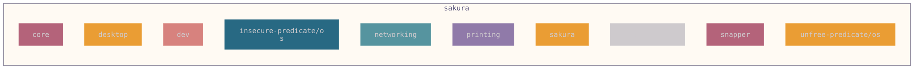

# Aspect Coverage

```mermaid
%%{init: {"theme":"base","themeVariables":{"activationBkgColor":"#fffaf3","activationBorderColor":"#9893a5","actorBkg":"#fffaf3","actorBorder":"#797593","actorLineColor":"#797593","actorTextColor":"#575279","background":"#faf4ed","classText":"#575279","clusterBkg":"#fffaf3","clusterBorder":"#9893a5","edgeLabelBackground":"#faf4ed","labelBoxBkgColor":"#fffaf3","labelBoxBorderColor":"#797593","labelTextColor":"#575279","lineColor":"#797593","loopTextColor":"#575279","mainBkg":"#fffaf3","nodeBkg":"#fffaf3","nodeBorder":"#797593","nodeTextColor":"#575279","noteBkgColor":"#fffaf3","noteBorderColor":"#9893a5","noteTextColor":"#575279","pie1":"#b4637a","pie2":"#ea9d34","pie3":"#d7827e","pie4":"#286983","pie5":"#56949f","pie6":"#907aa9","pie7":"#ea9d34","pie8":"#cecacd","pieLegendTextColor":"#575279","pieOuterStrokeColor":"#9893a5","pieSectionTextColor":"#575279","pieStrokeColor":"#9893a5","pieTitleTextColor":"#575279","primaryBorderColor":"#797593","primaryColor":"#fffaf3","primaryTextColor":"#575279","secondBkg":"#fffaf3","secondaryBorderColor":"#9893a5","secondaryColor":"#fffaf3","secondaryTextColor":"#575279","sequenceNumberColor":"#faf4ed","signalColor":"#797593","signalTextColor":"#575279","tertiaryBorderColor":"#9893a5","tertiaryColor":"#fffaf3","tertiaryTextColor":"#575279","textColor":"#575279","titleColor":"#575279"}}}%%
graph LR
  subgraph host_sakura["sakura"]
    sakura_core["core"]
    sakura_desktop["desktop"]
    sakura_dev["dev"]
    sakura_insecure_predicate__os["insecure-predicate/os"]
    sakura_networking["networking"]
    sakura_printing["printing"]
    sakura_sakura["sakura"]
    sakura_shell_entry["shell-entry"]
    sakura_snapper["snapper"]
    sakura_unfree_predicate__os["unfree-predicate/os"]
  end


  style sakura_core fill:#b4637a,stroke:#b4637a,color:#cecacd
  style sakura_desktop fill:#ea9d34,stroke:#ea9d34,color:#cecacd
  style sakura_dev fill:#d7827e,stroke:#d7827e,color:#cecacd
  style sakura_insecure_predicate__os fill:#286983,stroke:#286983,color:#cecacd
  style sakura_networking fill:#56949f,stroke:#56949f,color:#cecacd
  style sakura_printing fill:#907aa9,stroke:#907aa9,color:#cecacd
  style sakura_sakura fill:#ea9d34,stroke:#ea9d34,color:#cecacd
  style sakura_shell_entry fill:#cecacd,stroke:#cecacd,color:#cecacd
  style sakura_snapper fill:#b4637a,stroke:#b4637a,color:#cecacd
  style sakura_unfree_predicate__os fill:#ea9d34,stroke:#ea9d34,color:#cecacd
  style host_sakura fill:#fffaf3,stroke:#9893a5,stroke-width:2px
```
