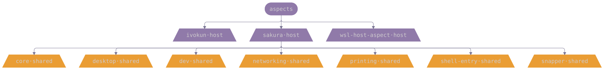

# Namespace

```mermaid
%%{init: {"elk":{"mergeEdges":true,"nodePlacementStrategy":"BRANDES_KOEPF"},"flowchart":{"wrappingWidth":600},"layout":"elk","theme":"base","themeVariables":{"activationBkgColor":"#fffaf3","activationBorderColor":"#9893a5","actorBkg":"#fffaf3","actorBorder":"#797593","actorLineColor":"#797593","actorTextColor":"#575279","background":"#faf4ed","classText":"#575279","clusterBkg":"#fffaf3","clusterBorder":"#9893a5","edgeLabelBackground":"#faf4ed","labelBoxBkgColor":"#fffaf3","labelBoxBorderColor":"#797593","labelTextColor":"#575279","lineColor":"#797593","loopTextColor":"#575279","mainBkg":"#fffaf3","nodeBkg":"#fffaf3","nodeBorder":"#797593","nodeTextColor":"#575279","noteBkgColor":"#fffaf3","noteBorderColor":"#9893a5","noteTextColor":"#575279","pie1":"#b4637a","pie2":"#ea9d34","pie3":"#d7827e","pie4":"#286983","pie5":"#56949f","pie6":"#907aa9","pie7":"#ea9d34","pie8":"#cecacd","pieLegendTextColor":"#575279","pieOuterStrokeColor":"#9893a5","pieSectionTextColor":"#575279","pieStrokeColor":"#9893a5","pieTitleTextColor":"#575279","primaryBorderColor":"#797593","primaryColor":"#fffaf3","primaryTextColor":"#575279","secondBkg":"#fffaf3","secondaryBorderColor":"#9893a5","secondaryColor":"#fffaf3","secondaryTextColor":"#575279","sequenceNumberColor":"#faf4ed","signalColor":"#797593","signalTextColor":"#575279","tertiaryBorderColor":"#9893a5","tertiaryColor":"#fffaf3","tertiaryTextColor":"#575279","textColor":"#575279","titleColor":"#575279"}}}%%
graph TD
  aspects([aspects]):::root
  core[/"core · shared"\]:::core_c
  desktop[/"desktop · shared"\]:::desktop_c
  dev[/"dev · shared"\]:::dev_c
  ivokun[/"ivokun · host"\]:::ivokun_c
  networking[/"networking · shared"\]:::networking_c
  printing[/"printing · shared"\]:::printing_c
  sakura[/"sakura · host"\]:::sakura_c
  shell_entry[/"shell-entry · shared"\]:::shell_entry_c
  snapper[/"snapper · shared"\]:::snapper_c
  wsl_host_aspect[/"wsl-host-aspect · host"\]:::wsl_host_aspect_c

  aspects --> ivokun
  aspects --> sakura
  aspects --> wsl_host_aspect
  sakura --> core
  sakura --> desktop
  sakura --> dev
  sakura --> networking
  sakura --> printing
  sakura --> snapper
  sakura --> shell_entry

  classDef root fill:#907aa9,stroke:#907aa9,color:#cecacd,font-weight:bold
  classDef core_c fill:#ea9d34,stroke:#ea9d34,color:#cecacd,stroke-width:2px
  classDef desktop_c fill:#ea9d34,stroke:#ea9d34,color:#cecacd,stroke-width:2px
  classDef dev_c fill:#ea9d34,stroke:#ea9d34,color:#cecacd,stroke-width:2px
  classDef ivokun_c fill:#907aa9,stroke:#907aa9,color:#cecacd,stroke-width:2px
  classDef networking_c fill:#ea9d34,stroke:#ea9d34,color:#cecacd,stroke-width:2px
  classDef printing_c fill:#ea9d34,stroke:#ea9d34,color:#cecacd,stroke-width:2px
  classDef sakura_c fill:#907aa9,stroke:#907aa9,color:#cecacd,stroke-width:2px
  classDef shell_entry_c fill:#ea9d34,stroke:#ea9d34,color:#cecacd,stroke-width:2px
  classDef snapper_c fill:#ea9d34,stroke:#ea9d34,color:#cecacd,stroke-width:2px
  classDef wsl_host_aspect_c fill:#907aa9,stroke:#907aa9,color:#cecacd,stroke-width:2px
```
