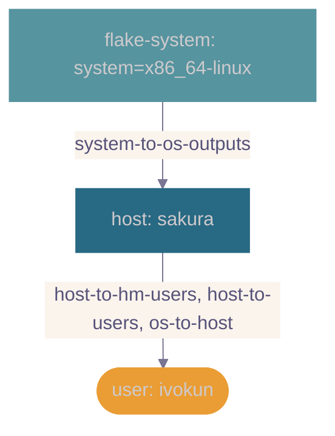

# Policy Resolution Map

```mermaid
%%{init: {"theme":"base","themeVariables":{"activationBkgColor":"#fffaf3","activationBorderColor":"#9893a5","actorBkg":"#fffaf3","actorBorder":"#797593","actorLineColor":"#797593","actorTextColor":"#575279","background":"#faf4ed","classText":"#575279","clusterBkg":"#fffaf3","clusterBorder":"#9893a5","edgeLabelBackground":"#faf4ed","labelBoxBkgColor":"#fffaf3","labelBoxBorderColor":"#797593","labelTextColor":"#575279","lineColor":"#797593","loopTextColor":"#575279","mainBkg":"#fffaf3","nodeBkg":"#fffaf3","nodeBorder":"#797593","nodeTextColor":"#575279","noteBkgColor":"#fffaf3","noteBorderColor":"#9893a5","noteTextColor":"#575279","pie1":"#b4637a","pie2":"#ea9d34","pie3":"#d7827e","pie4":"#286983","pie5":"#56949f","pie6":"#907aa9","pie7":"#ea9d34","pie8":"#cecacd","pieLegendTextColor":"#575279","pieOuterStrokeColor":"#9893a5","pieSectionTextColor":"#575279","pieStrokeColor":"#9893a5","pieTitleTextColor":"#575279","primaryBorderColor":"#797593","primaryColor":"#fffaf3","primaryTextColor":"#575279","secondBkg":"#fffaf3","secondaryBorderColor":"#9893a5","secondaryColor":"#fffaf3","secondaryTextColor":"#575279","sequenceNumberColor":"#faf4ed","signalColor":"#797593","signalTextColor":"#575279","tertiaryBorderColor":"#9893a5","tertiaryColor":"#fffaf3","tertiaryTextColor":"#575279","textColor":"#575279","titleColor":"#575279"}}}%%
graph TD
  host_sakura_system_x86_64_linux["host: sakura"]
  host_sakura_system_x86_64_linux_user_ivokun(["user: ivokun"])
  system_x86_64_linux["flake-system: system=x86_64-linux"]

  system_x86_64_linux -->|system-to-os-outputs| host_sakura_system_x86_64_linux
  host_sakura_system_x86_64_linux -->|host-to-hm-users, host-to-users, os-to-host| host_sakura_system_x86_64_linux_user_ivokun

  style host_sakura_system_x86_64_linux fill:#286983,stroke:#286983,color:#cecacd
  style host_sakura_system_x86_64_linux_user_ivokun fill:#ea9d34,stroke:#ea9d34,color:#cecacd
  style system_x86_64_linux fill:#56949f,stroke:#56949f,color:#cecacd
```
