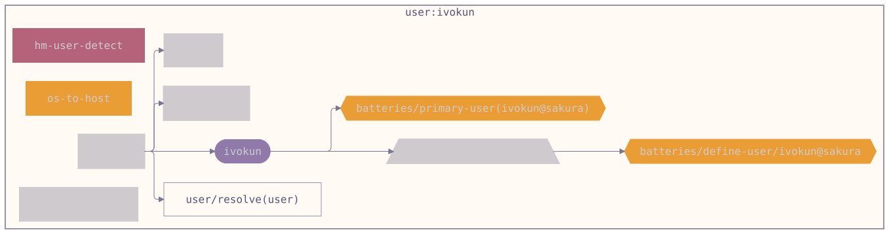

# Full DAG: ivokun

```mermaid
%%{init: {"elk":{"mergeEdges":true,"nodePlacementStrategy":"BRANDES_KOEPF"},"flowchart":{"wrappingWidth":600},"layout":"elk","theme":"base","themeVariables":{"activationBkgColor":"#fffaf3","activationBorderColor":"#9893a5","actorBkg":"#fffaf3","actorBorder":"#797593","actorLineColor":"#797593","actorTextColor":"#575279","background":"#faf4ed","classText":"#575279","clusterBkg":"#fffaf3","clusterBorder":"#9893a5","edgeLabelBackground":"#faf4ed","labelBoxBkgColor":"#fffaf3","labelBoxBorderColor":"#797593","labelTextColor":"#575279","lineColor":"#797593","loopTextColor":"#575279","mainBkg":"#fffaf3","nodeBkg":"#fffaf3","nodeBorder":"#797593","nodeTextColor":"#575279","noteBkgColor":"#fffaf3","noteBorderColor":"#9893a5","noteTextColor":"#575279","pie1":"#b4637a","pie2":"#ea9d34","pie3":"#d7827e","pie4":"#286983","pie5":"#56949f","pie6":"#907aa9","pie7":"#ea9d34","pie8":"#cecacd","pieLegendTextColor":"#575279","pieOuterStrokeColor":"#9893a5","pieSectionTextColor":"#575279","pieStrokeColor":"#9893a5","pieTitleTextColor":"#575279","primaryBorderColor":"#797593","primaryColor":"#fffaf3","primaryTextColor":"#575279","secondBkg":"#fffaf3","secondaryBorderColor":"#9893a5","secondaryColor":"#fffaf3","secondaryTextColor":"#575279","sequenceNumberColor":"#faf4ed","signalColor":"#797593","signalTextColor":"#575279","tertiaryBorderColor":"#9893a5","tertiaryColor":"#fffaf3","tertiaryTextColor":"#575279","textColor":"#575279","titleColor":"#575279"}}}%%
graph LR
  ivokun([ivokun]):::root

  subgraph ctx_user_ivokun["user: ivokun"]
  _policy_hm_user_detect__0_["<policy:hm-user-detect>[0]"]:::_policy_hm_user_detect__0__c
  n_default["default"]:::n_default_c
  den__batteries__define_user[/"batteries/define-user"\]:::den__batteries__define_user_c
  den__batteries__define_user__ivokun_sakura{{"batteries/define-user/ivokun@sakura"}}:::den__batteries__define_user__ivokun_sakura_c
  hm_user_detect["hm-user-detect"]:::hm_user_detect_c
  os_to_host["os-to-host"]:::os_to_host_c
  den__batteries__primary_user_ivokun_sakura_{{"batteries/primary-user(ivokun@sakura)"}}:::den__batteries__primary_user_ivokun_sakura__c
  user["user"]:::user_c
  user_to_host["user-to-host"]:::user_to_host_c
  user__resolve_user_["user/resolve(user)"]:::user__resolve_user__c
  den__batteries__define_user --> den__batteries__define_user__ivokun_sakura
  ivokun --> den__batteries__define_user
  ivokun --> den__batteries__primary_user_ivokun_sakura_
  user --> _policy_hm_user_detect__0_
  user --> n_default
  user --> ivokun
  user --> user__resolve_user_
  end


  classDef root fill:#907aa9,stroke:#907aa9,color:#cecacd,font-weight:bold
  classDef _policy_hm_user_detect__0__c fill:#cecacd,stroke:#cecacd,color:#cecacd,stroke-dasharray: 3 3,stroke-width:1px
  classDef n_default_c fill:#cecacd,stroke:#cecacd,color:#cecacd,stroke-width:3px
  classDef den__batteries__define_user_c fill:#cecacd,stroke:#cecacd,color:#cecacd,stroke-width:3px
  classDef den__batteries__define_user__ivokun_sakura_c fill:#ea9d34,stroke:#ea9d34,color:#cecacd,stroke-width:2px
  classDef hm_user_detect_c fill:#b4637a,stroke:#b4637a,color:#cecacd,stroke-width:2px,stroke-dasharray: 8 4
  classDef ivokun_c fill:#cecacd,stroke:#cecacd,color:#cecacd,stroke-width:3px
  classDef os_to_host_c fill:#ea9d34,stroke:#ea9d34,color:#cecacd,stroke-width:2px,stroke-dasharray: 8 4
  classDef den__batteries__primary_user_ivokun_sakura__c fill:#ea9d34,stroke:#ea9d34,color:#cecacd,stroke-width:2px
  classDef user_c fill:#cecacd,stroke:#cecacd,color:#cecacd,stroke-width:3px
  classDef user_to_host_c fill:#cecacd,stroke:#cecacd,color:#cecacd,stroke-width:2px,stroke-dasharray: 8 4
  classDef user__resolve_user__c fill:#fffaf3,stroke:#9893a5,color:#575279,stroke-dasharray: 2 2,stroke-width:1px
style ctx_user_ivokun fill:#fffaf3,stroke:#9893a5,stroke-width:2px
```
